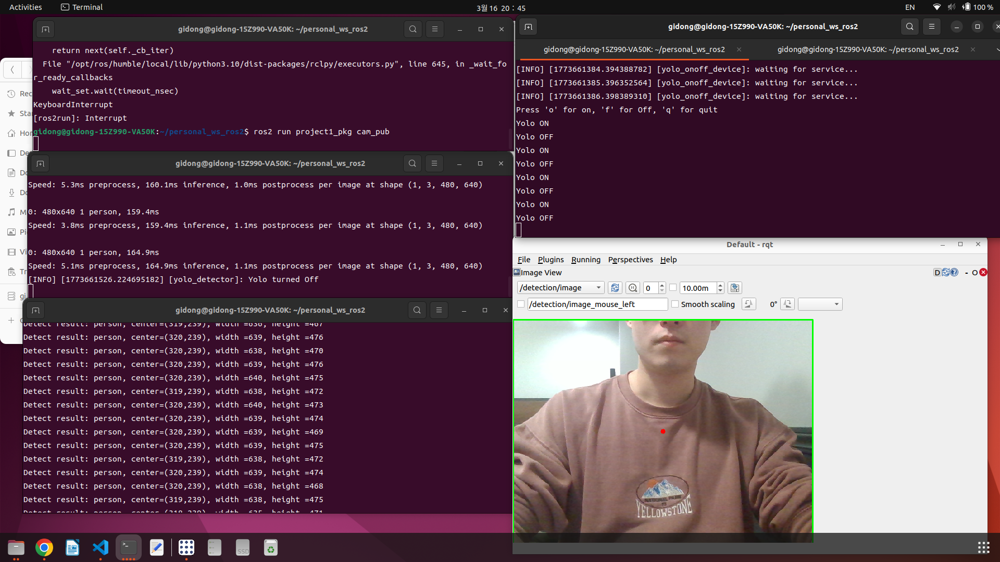
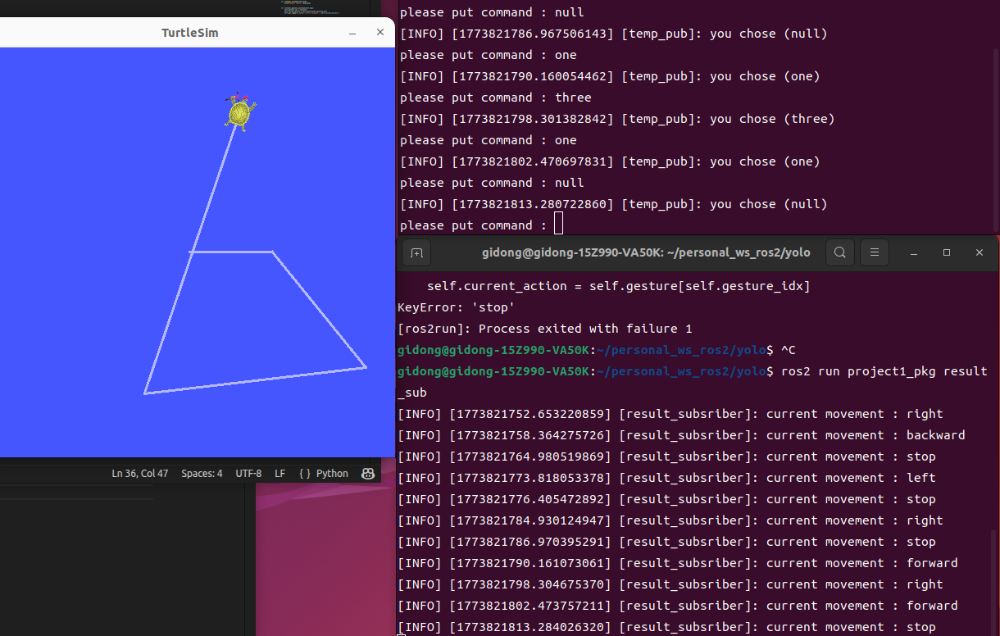

# Gesture Recognition Robot
using Yolo + ROS2 + Deep learning, I would like to develop a model that can capture gesture from humain, and it can follow to move in virtual space.   
- First objective is just simple hand movement like one finger, two finger, fist, or five    
- Next objective is following my entire hand movement    

# Consist 
## ROS2
- Topic : Camera-publisher, Yolo_subscrition(detection)
- Service : Yolo_onoff client/server
- Action :

## Diagram

# Conclusion

# Experiment(Journey)
- on/off function(pusing o,f button, yolo can be turned on/off) - 3/16
   

- move turtlesim using input command in terminal(it should be object detection in the future) - 3/18

# My Jouney
- 3/14 create package Yolo
- 3/16 seperate function of cam, yolo, and add on/off function
- 3/18 add temp_publisher(to send a message for command), and move to turtlesim for test
