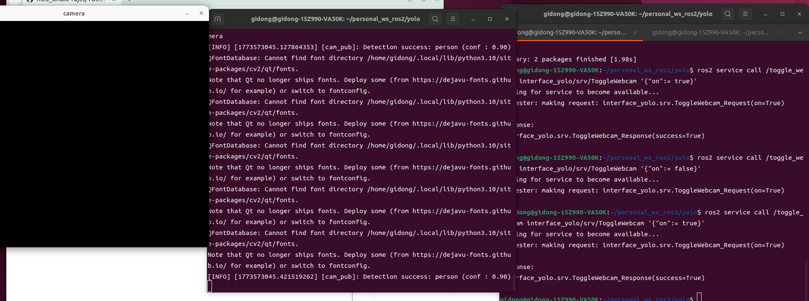

# QT Freezing

- When the webcam and detection were implemented in a single node and the service on/off function was also used together, the system got stuck and the webcam stopped working.
- I tried to solve this problem using **MultiThreadedExecutor**, but it made the situation worse.  
  Because webcam streaming and YOLO inference are both CPU-intensive tasks, running multiple callbacks in parallel caused resource contention and blocked the communication between nodes.
- To solve this issue, I separated the system into three nodes: **webcam**, **YOLO detection**, and **result processing**.  
  After separating the nodes, the pipeline worked properly without freezing.

# Data imbalance
- data supplement

